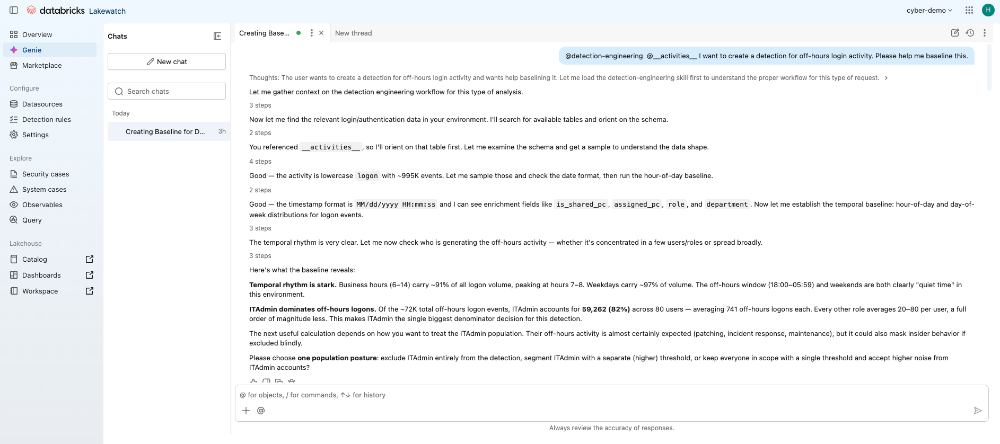
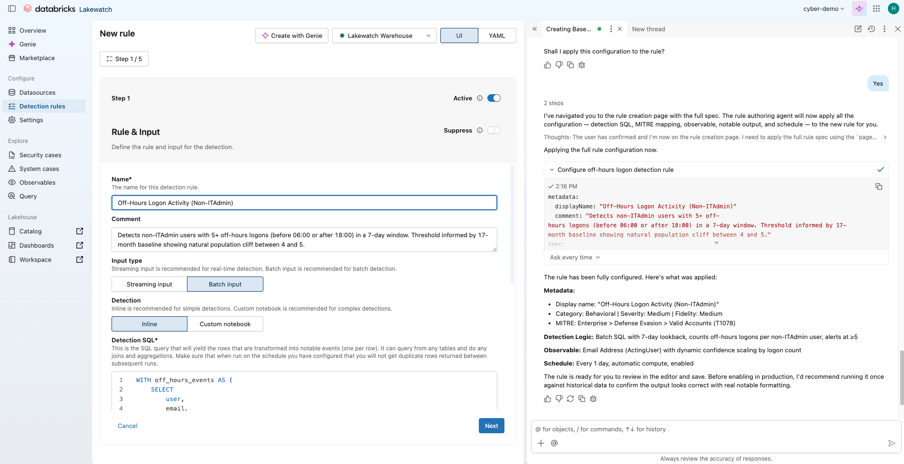

# Detection Engineering Skill for Databricks Genie Code

A [Genie Code skill](https://docs.databricks.com/aws/en/genie-code/skills) that turns Databricks Genie Code's Agent mode into a helpful detection engineering assistant. Ask Genie natural-language questions about your security telemetry — it runs bounded SQL, surfaces distributional evidence, asks for input when encountering ambiguity, and helps you package defensible detection rules.

## What is Genie Code?

[Genie Code](https://docs.databricks.com/aws/en/genie-code) is the AI coding assistant built into Databricks workspaces. It generates and runs code, queries, and pipelines directly inside notebooks, the SQL editor, and other development surfaces. 

## What this skill does

The skill helps Genie assist Detection Engineers using a structured workflow:

1. **Orient** — describe the table schema and sample rows
2. **Baseline** — measure frequency, timing, and behavioral distributions
3. **Segment** — split by entity, role, or time dimension to isolate signal from noise
4. **Evaluate** — backtest candidate detection logic against historical data
5. **Package** — produce a detection spec with candidate logic, evidence, and caveats

This skill comes packaged with reference files containing example SQL queries that help Genie analyze your security telemetry data. These references can be modified and extended based on your needs.

| Analysis | Reference file |
| --- | --- |
| Column profiling (null rate, cardinality, top values) | `summarize-columns.md` |
| Hour-of-day / day-of-week baselines | `temporal-baseline.md` |
| Percentile distributions per entity or segment | `grouped-percentiles.md` |
| Per-entity behavioral rates (off-hours %, failure rate, etc.) | `derived-rate-percentiles.md` |
| Backtest candidate detection logic (event-level, aggregate, time-bucketed) | `evaluate-detection-rule.md` |
| Gap analysis between events (beaconing, brute-force, automation) | `inter-event-time.md` |

---

## Setup

### Prerequisites

- A Databricks workspace with Genie Code enabled
- Access to Agent mode in Genie Code (Full Page mode)
- Unity Catalog `SELECT` permission on the security telemetry tables you want to baseline

### Install the skill

Skills are discovered by Genie Code from a fixed directory path in the Databricks workspace file system. Choose one:

**Workspace-wide skill** (available to all users in the workspace — requires workspace admin access):

```text
Workspace/.assistant/skills/detection-engineering/
```

**Personal skill** (available only to you):

```text
/Users/{your-username}/.assistant/skills/detection-engineering/
```

**Steps:**

1. In the Databricks workspace, navigate to the target directory above using the Workspace file browser.
2. Create a folder named `detection-engineering`.
3. Upload all files from this repo's `detection-engineering/` folder into it:
   - `SKILL.md`
   - `summarize-columns.md`
   - `temporal-baseline.md`
   - `grouped-percentiles.md`
   - `derived-rate-percentiles.md`
   - `evaluate-detection-rule.md`
   - `inter-event-time.md`
4. Open a new Genie Code chat thread (Agent mode). Skills are auto-discovered on the next Agent mode session — no registration step required.

> **Tip:** If the skill doesn't appear to activate, start a fresh chat thread. Stale sessions may not pick up newly installed skills.

### Use the skill

In Agent mode, reference the skill explicitly with an `@mention`:

```text
@detection-engineering I want to baseline off-hours logon activity in catalog.security.logon_events
```

Genie Code will invoke the skill's `SKILL.md` instructions and load reference files on demand as the analysis progresses.

---

## Example walkthrough

The screenshots below show a full session: from an open-ended question about off-hours logon activity to a packaged detection rule.

### Step 1 — Ask a natural-language question

In Agent mode, ask something like:

> "I want to create a detection for off-hours logon activity. Can you baseline this for me?"

Genie Code invokes the detection-engineering skill. It starts autonomously: orients itself on the schema, measures the overall off-hours event volume, and segments by user to surface where activity is concentrated — before asking you anything.



### Step 2 — Supply expert context and iterate

Respond with the context Genie can't infer from SQL alone:

> "Yes, exclude ITAdmin. The business window is 08:00–18:00 Monday–Friday. Treat service accounts separately."

### Step 3 — Package the detection rule

When the evidence is strong enough, ask Genie to package it as a new detection rule in Lakewatch:

> "That looks good — package this as a detection rule."

Genie will navigate you to the Detection Rules tab in the Lakewatch UI, fill out the fields based on your converstaion, and create the detection rule for you.



---

## Skill structure

```text
detection-engineering/
├── SKILL.md                      # Main skill definition — loaded by Genie Code
├── summarize-columns.md          # Column profiling templates
├── temporal-baseline.md          # Hour-of-day and day-of-week baselines
├── grouped-percentiles.md        # Percentile distributions per entity
├── derived-rate-percentiles.md   # Per-entity behavioral rate calculations
├── evaluate-detection-rule.md    # Detection rule backtesting (3 templates)
└── inter-event-time.md           # Gap analysis between consecutive events
```

`SKILL.md` defines the agent's behavior and references the other files via relative links. Genie Code loads each reference file only when that analysis type is needed, keeping responses focused.

